```{r setup, include=FALSE}
knitr::opts_chunk$set(echo = TRUE)
```

# Johnson City Parks and Recreation Economic Impact Analysis 

                                            
$\qquad$This study aims to perform an Economic Analysis on behalf of the Johnson City Parks and Recreation Department. Our partner, the Parks and Recreation Department of Johnson City, wants to analyze the effect on tourism a planned park expansion will have on the region. The park expansion will consist of 4 new baseball/softball fields, and 6 soccer fields. This will bring the parks total amenities to 9 baseball/softball fields and 8 soccer fields. It is also important to note that the expansion will consist of entirely artificial play surfaces. Being that the park expansion will be an additional input for the regions tourism numbers overall, the parks department naturally wants to know what the expected economic impact will be on the region due to this increase in tourism. To perform this analysis we will be relying on information from a variety of sources in order to construct a table of known expenditures. From there, we make use of the RIMS II multiplier tables which are generated using an I/O model of the region.This will allow us to create region specific impact estimates that we can share with the parks department, and they in turn can use to share with interested parties. This will also allow the park department to have estimates as to how this project will impact their bottom line. First and foremost we analyze the data as we received it from the Parks and Recreation department. Second, we introduce the secondary studies used as reference for our own. Third we will cover preliminary calculations made using methods outlined in these secondary studies. Fourth, we will be talking about the Input/Output models and the RIMS II tables which will be utilized later in the study. And lastly, fifth, we will be talking about where the project will be going from here.  
  
  
  
## Part 1 The Data 

$\qquad$ Initially for this study we received data for the 2022 and 2023 baseball seasons and the maintenance charged for the use of the baseball fields. The data contained the number of teams, the date of the tournament, and the amount charged to the director of the tournament for use of the fields.  
  To begin with, we took the data received and put it into the form of a table making it compatible with software packages like R, Python, or Eviews. Additionally, we referred to some secondary studies in order to pad out the data further with such information as initial party spending estimates or non-local percentage of attendees. We will cover this secondary information in Part 2, but for now, our focus will remain on the initial data.\newpage 
  
```{r, echo=FALSE}
parks<-readxl::read_excel("C:\\Users\\super\\OneDrive\\Documents\\JC Parks and Rec stuff\\Copy of JC Parks and Rec data software friendly.xlsx")
#head(parks)
library(knitr)
knitr::kable(parks[1:5,1:10], format="latex")
```
A brief breakdown of the data set created can be summarized by the following variables:\newline 

* days: The duration of the tournament in days \newline 
* teams: The number of teams participating in a tournament \newline
* fee: The fee charged to the tournament director for use of the park\newline 
* labor: The labor cost associated with running the tournament\newline 
* material: Material cost associated with running the tournament\newline
* combined: Combined Labor and Material cost\newline 
* month: the month in which the tournament took place\newline
* players: The number of players participating in the tournament (extrapolated information) \newline
* spending: Average spending per tournament calculated using information from secondary study \newline
* nonlocal: The adjusted spending amount assuming 89% nonlocal tournament participation rate (obtained from secondary study)\newline


```{r, echo=FALSE}
knitr::kable(summary(parks)[1:6,1:7], format="latex")
knitr::kable(summary(parks)[1:6,8:10], format="latex")
```


$\qquad$From a glance at the summary statistics for the information, we can gain some insight into the behaviour at the parks. For instance, we can see that the median number of days for park tournaments is 1 day. We can also see that the mean number of teams is ~19.23 per tournament, and that they were charged on average 552.6 dollars to participate in the tournament. When looking at player counts we can see that on average each tournament brings around 403 players to the region. Lastly, we can see from data provided, the average initial estimates for expenditures put the average at around $142,244 per tournament. This table as configured includes data for both 2022 and YTD 2023. 2021 data is available and will be accounted for in subsequent report versions.\newline

 
```{r, fig.align='center',echo=FALSE}
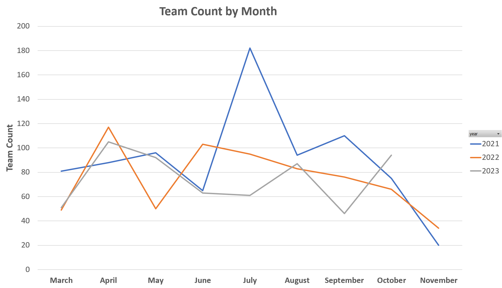
```

$\qquad$In Figure 1 we can compare the number of players per month for the three years for which we have data. It is important to note that while the team counts come directly from the information given, the players per team and the average expenditures per team for these graphs are based on the estimates of 14 players per team and $206 per day expenditure. Also note that complete September, October, and November data for 2023 is not accounted for in this figure.(Will be updated in following versions of report)\newline 

Looking at the figure we can see that 2021 overall seemed to have the highest team count.This can partially be attributed to several large tournaments that were held in 2021 according to the information received. We can also notice that the demand for the fields seems to be fairly constant throughout the baseball/softball season. Some of the low counts per month that are observable are due to rain-outs, in which the tournament was cancelled due to unplayable conditions. 
Looking at additional visualizations, we can likewise compare spending by year.
```{r, fig.align='center',echo=FALSE }
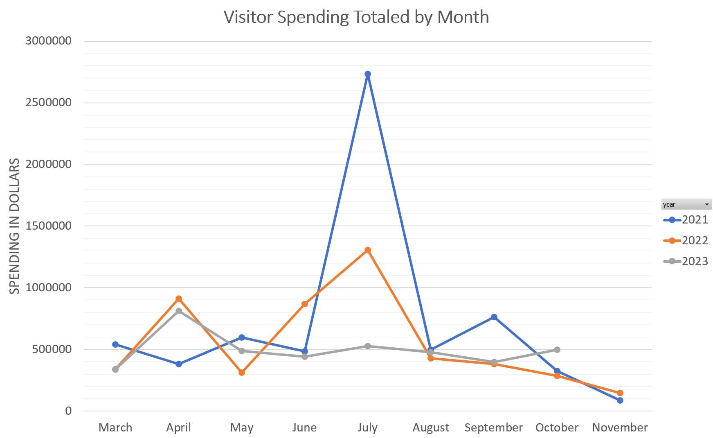
```
$\qquad$Unsurprisingly we can see in Figure 2 that the spending per tournament closely mimics that of the number of players per tournament, intuitively suggesting that the more players there are in a given tournament the more spending occurs in the region. We can also see, again, rather intuitively, that if the tournament does not take place then there is no spending in the region because there are no players in the region. We can also observe that on the average, spending remains fairly constant throughout the season after an initial peak at the beginning of the season (relatively speaking). \newline
```{r, echo=FALSE}
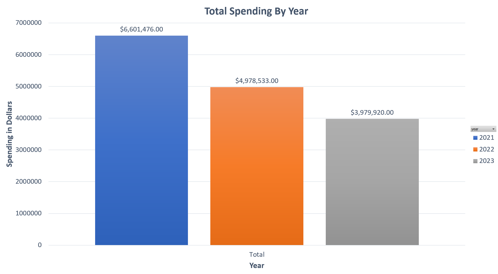
```
In Figure 3 we can see this spending summed and compared by year. Once again, keep in mind that this graph does not represent the 2023 complete data and so this number will increase once all data is accounted for. \newline

$\qquad$Additionally, we can take a look at the tournament type per year. This is an important attribute to take into consideration as day trip spending is usually close to half of what the overnight spending is. As such, seeing how many tournaments took place and what their duration was can be an important consideration when performing these estimates. \newline 
```{r, echo=FALSE}
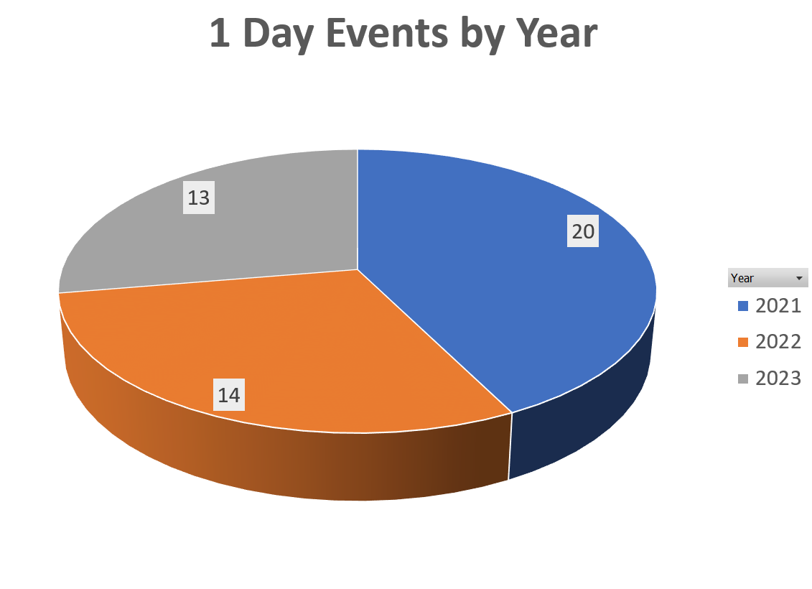
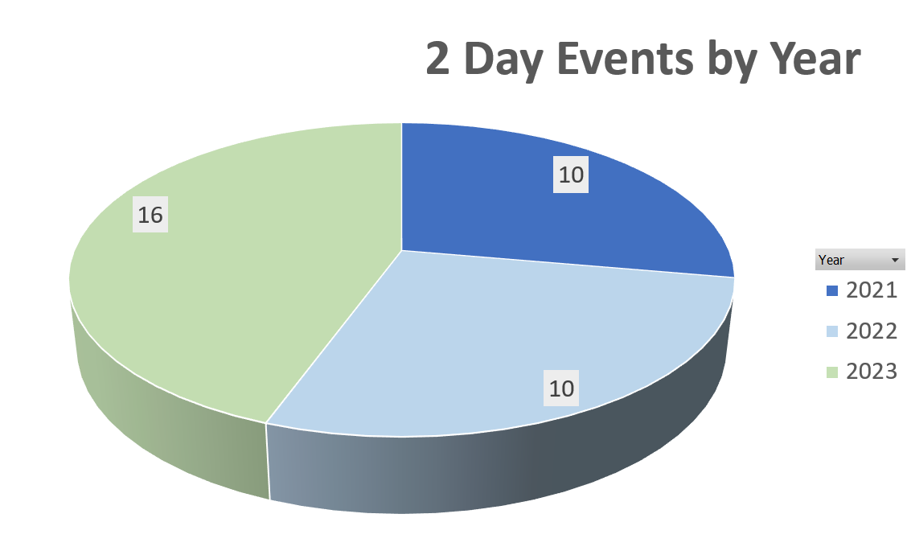
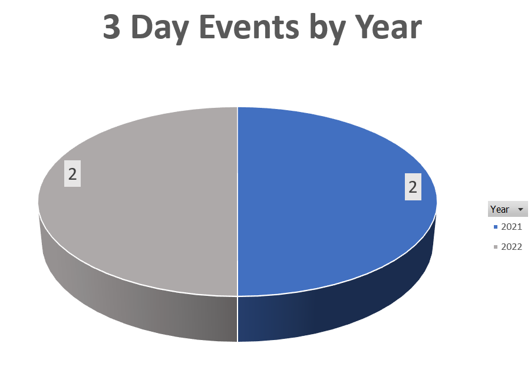
```

$\qquad$Looking at the charts we can see that 2023 has actually had the larger number of 2 day events and 1 day events when compared to 2021 and 2022. However, it can also be observed that 2021 and 2022 are the only years which had tournaments that were 3 days in length. Regardless, it is encouraging to see the number of overnight events seeming to increase for 2023 when compare to the previous two year, and is hopefully indicative of a trend that will continue.\newline

$\qquad$Maintenance cost need to also be taken into consideration as it is a cost the park is responsible for. To compensate for this cost the park charges teams a fee to compete at the park. The fee is not designed to make a profit for the park, but rather exist in order to cover material and labor cost. In the figure below, we can see a comparison between the total fees charged by the park and the maintenance cost per year based on the scans received by the park for 1, 2, and 3 day tournaments. It should be noted that this maintenance charge does not take into account additional cost imposed upon the park such as the cost of running the lights, prepping the field after rain, or other accommodations provided by the park for the teams.
 
```{r,fig.align='center',echo=FALSE}
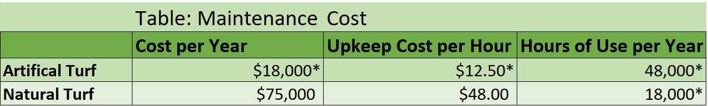
```

$\qquad$Looking at the maintenance cost comparisons, we see the expected behaviour, where the most we can pull from this is how many of each type of tournament occurred. This is known due to the cost associated with each tournament, where the 1 day tournaments cost ~2000, the 2 day tournaments cost ~3800, the 3 day tournaments cost ~6000, and the 4 day tournament is calculated to have cost ~8000. We can see that 2023 appears to have had a greater number of 2 day tournaments when compared to 2022. There have been no large peaks with a four day tournament so far in 2023.\newline

$\qquad$Lastly, we can look at the fees charged to the tournament directors isolated from the maintenance cost by month over the three years. 
```{r,fig.align='center',echo=FALSE}
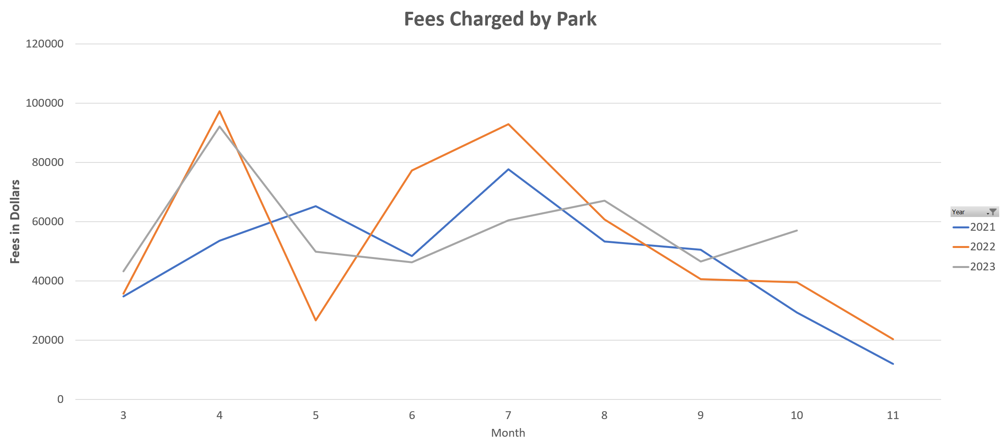
```

$\qquad$Looking at the fee comparison between 2022 and 2023, we can see that 2023 actually seems to trend somewhat higher in the average price charged to the tournament directors, relative to the same month. Overall the difference is:

```{r, echo=FALSE}
#fee23avg<-mean(sub_fee2)
#fee22avg
#fee23avg
#fee23avg-fee22avg
```

$\qquad$The average for 2022 is 554 dollars and the average for 2023 is 766. This is a 212 dollar increase over the previous year. This is inline with expected cost increases and adjusting pricing to accurately reflect the cost of maintenance. 

## Part 2 The Secondary Studies 

$\qquad$  One important secondary study is by Brewer and Freeman. This study has been essential to our progress for a multitude of reasons. First and foremost it summarizes the steps required to perform an analysis using its methods, and this summary is clearly laid out. Secondly, it gives us additional information to use in our own study. Third, it has highlighted the need for a certain degree of reliance upon secondary studies to complete the analysis as a full fledged analysis independent of these studies would be both time consuming and expensive. And fourth, because the city of interest in the study is of a similar size and population density as Johnson City, making it almost like a sister city, and as such a great blueprint for creating an analysis for a small city. \newline

$\qquad$ The required inputs for this method of analysis are few in number. The first being the number of tourist. This means we need to be able to calculate or estimate the total number of attendees at each tournament, as expenditures often increase as the number of party members increase. However, just as important as the number of attendees itself, we need to know how many of those attendees are non-local. This is because in economic analysis, we cannot count money that is already circulating in the region. This means that if a tournament where to take place at Winged Deer Park, but all the attendees originated from Johnson City, then there would be no measurable impact from the tournament on the local economy because the money would have been spent in the economy either way. For this reason, we must estimate to some degree of accuracy how many non-local attendees come to each tournament in order to obtain the most accurate impact estimates. The next input we need using this method is average spending per visitor. Fortunately for us, some amount of this information we can obtain locally through visitJC, an governmental agency that collects data on the region, including tourism data. For events that we do not have data on our for which data cannot be provided, we can rely on secondary studies once we adjust the spending to our region. \newline
$\qquad$Lastly, we need the appropriate multiplier and capture rate. This is where the methods in the study begin to deviate from methods outlined in other studies. One method is to use the Input/Output model method, which is an economic model that depicts the inter-dependency between industries in a local economy and shows how output from one industry may be used for the input in another industry, giving the user a detailed look at the complex web of connections between producers. Here however, the multiplier, instead of being produced by using an Input/Output model, we refer to another study [2] in which a multiplier for the tourism industry was calculated that relies on the population for the region in which the analysis is being performed and the population density of the region.
We will explore this further in the preliminary calculations section, but for now, its just important to note that this method does not rely upon the Input/Output tables. In addition to the multiplier, we need the capture rate for this method, which is also obtained via a secondary study. We will explore this further in the preliminary calculations section, but for now, its just important to note that this method does not rely upon the Input/Output tables. In addition to the multiplier, we need the capture rate for this method, which is also obtained via a secondary study. Knowing all of this we can begin to focus on the deficiencies in our own data set. For starters, we will be able to find the total spending per party, which we currently don't have. The values for spending in our current data set come from the tables presented in this study:
```{r, echo=FALSE}
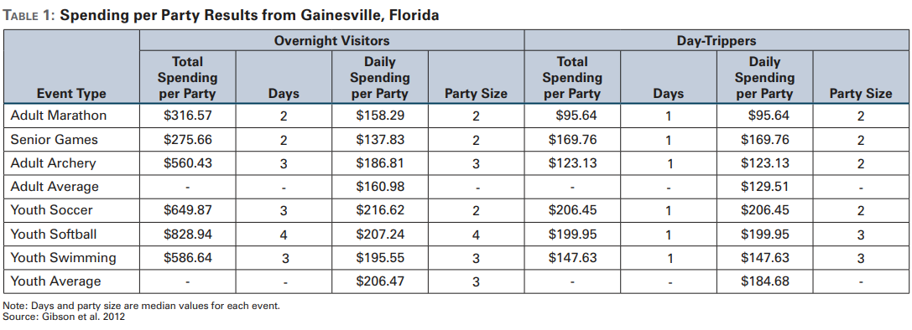
```

$\qquad$It is important to note those tables were generated in 2012. Not only has the cost of living increased in this time, but this is also long enough that changes in consumer spending habits should also be taken into consideration. While these points are worth considering, it should be noted that the values assumed in this table are not used outside of the preliminary estimates that were generated. The reason for this is at the time the preliminary estimates were generated we did not have the information from visitJC. Once we received the information about visitor spending habits in the region, the estimates provided in this table were no longer required. All the same, this table is mentioned as it and the one below were the initial starting point for out own estimates.  \newline 

$\qquad$ We also need to segment our data by event type. That is easy at the moment as we only have one event type, and that is baseball tournaments. We can bring in local softball information as it becomes available, but for the soccer data, all information will have to be gathered from secondary sources as non exist from local sources. \newline 

$\qquad$ Once we have this information we then need to find the non-local percentage of attendee:
```{r, echo=FALSE}
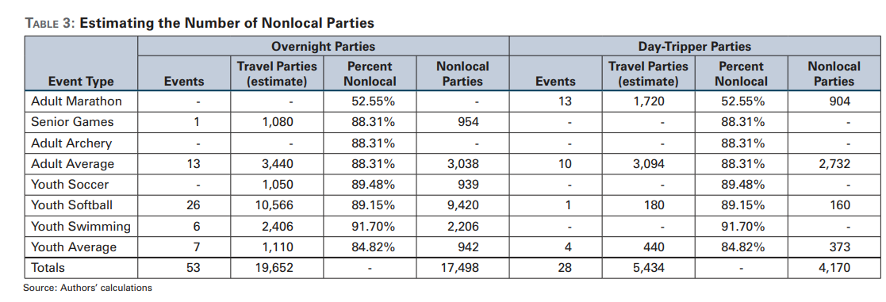
```

The other information in the tables needs to be calculated by event type. It is important to segment the information by event type as often the numbers change based on the event. Keeping these separate will allow them to be calculated more accurately and then can be summed together to find the total estimated impact.\newline 

$\qquad$Another point of reference has been the study by Crompton and Lee. In the study, Crompton and Lee bring to light some important considerations for a study of this type. 
One of the main ones being, and rather important to our goals, is that the economic impact on a community when a tournament does not require an overnight stay is small. Typically one should not expect expenditures for these trips to exceed a range of 55 to 100 dollars (in 2000 USD). A follow up to this point is that a large event with a large amount of attendees is unlikely to have a large impact or any impact if 'time-switchers' are not accounted for.\newline 

$\qquad$Even more importantly however, the authors outline key principles to adhere to in order to avoid mistakes made in other studies that create overestimates of impact:\newline 
   * Exclusion of local Residents\newline 
   * Exclusions of Time Switchers \newline
   * Use of Income rather than Sales(Output) Measures\newline
   * Careful Interpretation of Employment Measures \newline
$\qquad$In addition to these principles, there are a couple of other points that the authors bring up that would be worth consideration:\newline
* Adult Tournaments typically involve higher expenditures \newline
* Softball had roughly double the rate of expenditure as soccer\newline
* Soccer requires no very little equipment so the opportunities for commodification are few \newline
* For small and medium sized communities that lack resources to stage large scale festivals sports tournaments are likely to be a superior means of generating positive local impact\newline 
* A larger proportion of sports tournaments are more likely to recognize positive impact versus large scale special events\newline
* Existing staff at hotels, restaurants, retail establishments etc. are likely to have the spare capacity to handle any visitors that result from a tournament. Even if they do not a manager will reorganize shift schedules or pay overtime. ONLY IF these adjustments are unable to accommodate additional jobs will these businesses hire additional workers. This is why the Employment multiplier must be interpreted carefully. \newline 

$\qquad$The last study which we have been relying upon is the study by Stynes. This has been a handbook to guide us through the process of variable selection and understanding not only how to perform an economic analysis but understanding what it is and the best practices surrounding its creation. This study helps in understanding how the capture rate is actually calculated, but it is just as important to note that the capture rate does not apply to our economic analysis. The reason why is due to the fact that the capture rate is used to 'capture' the leakage in a regional economy due to goods and services that are consumed within the region being produced outside of the region. For instance, if a person spends $100 at a bakery, but the bakery buy all of its dough/ingredients from out of town, then this cut the circulation of that 100 within that region. Since multipliers rely on the circulation of money within an economy to generate positive impact, then this effectively reduces the multiplier. That being said, since we are using RIMS II, we do not have to worry about calculating the capture rate as RIMS II multipliers account for leakage. More on this in the section about the Input/Output Models. Capture rate aside, the study by Stynes has proven to be extremely useful as a guide, not only on what various methods are but the considerations to keep in mind when attempting to select a method or perform an analysis.\newpage

## Part 3 Preliminary Estimates 

$\qquad$In this section we will briefly cover some of the preliminary calculations made with the data. Be aware that these calculations are extremely rudimentary and follow the procedure as well as borrow some of the data from another study. This is being highlighted as it is important to understand that these estimates may be highly inaccurate and may in no way reflect the actual impact. It should also be mentioned that none of these calculations will be used for the final estimates as we will be making use of the RIMS II multipliers and therefore do not have to calculate our own. This will be discussed further in the section covering the Input/Output model.\newline 

$\qquad$For our preliminary calculations we followed the methods outlined in (Brewer/Freeman), but since we only had data for the baseball tournaments then this is what we applied the method to. As such, these estimates are only for the baseball tournaments that occurred for 2022 and 2023 and do not include any data on softball or soccer.\newline 

$\qquad$Following the outlined methods, we began our analysis by finding the population of Johnson City(important to note the city population and not the county population was used here). For Johnson City the most current US census data gives us a value of 71,278(2021). The population density was also derived from census data, and for Washington County we have a population density of 0.4074(in thousands).\newline 
$\qquad$Having found both the population for the area of interest as well as the population density, we can use Chang's Formula as outlined. This formula is: \newline
$$Chang's Multiplier:1.566+(0.53*ln(POP))-(0.0009*POPden)$$
\newline 
Where:\newline 
* POP is the regions populations in millions \newline 
* POPden is the regions populations density in thousands\newline

With our values inserted into the equation we found the following:\newline 
$$1.566+(0.53*ln(0.071278))-(0.009*0.4074)=1.42583$$
\newline 

$\qquad$This multiplier attempts to replicate the multipliers found using Input/Output models such as RIMS II, IMPLAN, or MGM. However, this multiplier is cost effective as the cost of these models varies and for small departments in small cities the cost can be prohibitive. As such this is an excellent substitute and gives a reasonable degree of accuracy. Likewise, since we are not using a multiplier derived from a table for this initial estimate, this means that we must also use a capture rate to account for leakages in the region. Here, we just assumed the 60-70% capture rate found by Styne, discussed previously. This is easily accomplished by multiplying the upper and lower range percentages by Chang's Multiplier to adjust the multiplier effect.\newline
Some of the assumptions we made when performing these calculations:

* Day Spending Average per party = 206
(This value is obtained from the tables listed in Section 2)
* Non-local Percentage = 89%
(This value also comes from the tables listed in Section 2)
* Overnight Spending was found by multiplying the duration of the tournament in days by the average daily expenditures
These assumptions lead us to values of: 
* $4,430,894.37 for the 2022 year
and, 
* $3,099,362.70 for the 2023 year \newline

```{r,echo=FALSE, center}
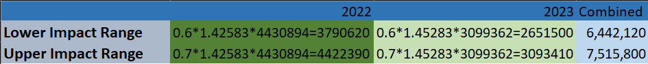
```


$\qquad$It is important to note that these calculations only include the data given so far. This means that this estimate is for the tournaments that have previously taken place on the current 5 baseball/softball field setup. For the purposes of the economic impact analysis we will be creating additional estimates that hope to capture the impact the expansion will bring. Those estimates will be produced using Multipliers from the RIMS II Input/Output model. However, this does give us some preliminary insights into the impact that sports tourism, even on a smaller scale, has on the region. Further, we see that give the cost of maintaining the fields themselves is absorbed by the department, however the regional impact is far greater than the cost associated with said maintenance.\newline

$\qquad$Additionally, we can now report on a breakdown of the softball tournament spending based off of the information received from visitJC. This data captured several key attributes we are interested in for our study, such as non-local percentages of attendants as well as a break down of their spending while in the region by industry. We then took the data given by the JC Parks and Recreation department for the 2023 year and looked at each event that took place to try and make a determination of what type of event (baseball/softball) took place on each date. Unfortunately we were unable to find event types for all events that took place in 2023, as not all events seemed to be listed on calendars or had public announcements about their occurrence. As such for events that we could not find dates for we made assumptions about which type of event occurred during which part of the year. Baseball events appeared to occur with a higher frequency at the beginning of the year, where as softball events seemed to occur more often at the end of the year, with both events taking place during the months of June and July. Using this information and assumptions we determined that there were 18 baseball games and 17 softball games that took place.Using this information in addition to the information provided by visitJC we were able to come up with estimates for only softball events at the park. One of the first steps was to make sure we were assuming correct team sizes for these tournaments.\newline 

For softball teams, from what was able to be recovered, this means we should assume 15 players per team for each tournament. We put this number at 17 total, to account for the 15 players and 2 support staff such as a head coach and assistant coach.  We additionally need to take into account the differences between spending at event types. That is, the average spending per party differs for groups that are in the region for day time events and those that participate in overnight events and stay in the region as a result. Based on the information provided by visitJC and working backwards with our assumptions for the number and duration of each event, we found that night trip spend was roughly $110 per person. On the other hand, the day trip on average resulted in half the expenditure at 55/day.
To get our estimates we performed calculations based on the following:\newline
```{r, echo=FALSE}
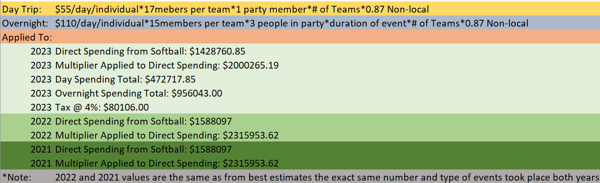
```
\newline 
These estimates should be a reflection of the actual spending occurring in our region, along with the correct non-local percentage applied, as all of the calculations are based off of the information provided by visitJC. It is also worth noting that these estimates are not broken down into the type of spending done by each party member. In future reports this spending will be broken down to be percentage based so that total spending by industry can be provided. This will also be necessary if we are to progress to the next step in ensuring accuracy. And that is the use of the RIMS II input/output model and its multiplier tables. The current Multiplier adjusted values displayed in the figure above are found using the method previously highlighted, in which Chang's Multiplier is used instead of the RIMS II multipliers tables. The reason for this, is that at this stage we do not have spending segmented by industry, and since the RIMS II multipliers require us to know the spending per industry in order to use them, we use Chang's Multiplier instead as it allows us to apply an region wide multiplier to the estimates without having to compartmentalize spending. In the next section we will go further into the RIMS II input/output model, its multipliers, and why this has been selected. 

## Part 4 Input/Output Models 

$\qquad$In this section, we discuss what an Input/Output model is, and what it is used for in economic analysis.\newline 
$\qquad$ The Leontief matrix, also known as the Input-Output matrix or the Leontief input-output model, is a fundamental component of input-output analysis in economics. It was developed by the Russian-American economist Wassily Leontief in the 1930s as a way to model the interdependencies among various sectors of an economy. The Leontief matrix represents the flow of goods and services between sectors within an economy.\newline 

Here's a more detailed explanation of the Leontief matrix and its key components:\newline 

1. Matrix Structure:\newline 
 $\qquad$  - The Leontief matrix is a square matrix, meaning it has the same number of rows and columns.\newline 
 $\qquad$  - Each row and column in the matrix corresponds to a specific economic sector within the analyzed region or economy.\newline 

2. Elements of the Matrix:\newline 
 $\qquad$  - The elements (entries) of the matrix represent the amount or value of goods and services purchased by each sector from all other sectors, including itself.\newline 
 $\qquad$  - Typically, the entries are represented as aij, where "i" refers to the row (the purchasing sector) and "j" refers to the column (the selling sector).\newline 

3. Interdependence:\newline 
 $\qquad$  - The Leontief matrix captures the interdependence of economic sectors. It shows how much each sector depends on other sectors for intermediate inputs.\newline 
 $\qquad$  - For example, the construction sector might purchase steel from the manufacturing sector, and in turn, the manufacturing sector might purchase construction services for its buildings. This interdependence is reflected in the matrix.\newline 

4. Diagonal Elements:\newline 
  $\qquad$ - The diagonal elements (aii) represent the "self-purchases" of each sector. This is the amount of goods and services a sector produces and consumes itself.\newline 
 $\qquad$  - Self-purchases are usually found on the diagonal of the matrix because each sector buys from itself.\newline 

5. Off-Diagonal Elements:\newline 
 $\qquad$  - The off-diagonal elements (aij, where $i\neq j)$ represent the purchases by one sector from another sector. These entries quantify the flow of goods and services between sectors.\newline

6. Use in Economic Analysis:\newline
  $\qquad$ - The Leontief matrix is a critical tool for economic analysis, especially for input-output analysis and computable general equilibrium modeling.\newline
  $\qquad$ - It allows economists to estimate the ripple effects of changes in one sector on the entire economy. For example, if there's an increase in consumer demand for automobiles, the Leontief matrix can help calculate the resulting increase in production and employment in the automotive sector, as well as its effects on other related sectors.\newline

7. Multipliers:\newline
 $\qquad$  - The Leontief matrix is used to calculate economic multipliers, such as the output multiplier, income multiplier, and employment multiplier. These multipliers show the total economic impact of changes in demand or production in a specific sector.\newline

8. Data Source:\newline
 $\qquad$  - The data used to populate the Leontief matrix comes from various sources, including national or regional economic surveys, input-output tables, and industry reports.\newline

Some of the assumptions the RIMS II model uses when generating its multipliers are:\newline 

### Backward linkages.

I-O models can measure the impact of an industry’s production on other industries in two ways. In a backward-linkage model, an increase in
demand for output results in an increase in the demand for inputs. In a forwardlinkage model, an increase in the supply of inputs results in an increase in the
supply of output.
RIMS II is a backward-linkage model. To give an example of the impact measured
by RIMS II, consider the expansion of a warehouse. The impacts of the expansion
estimated with the model’s multipliers will account for the increase in demand
for inputs by the warehouse but will not account for the increase in production
by the industries that may use the warehouse.\newline

### Fixed purchase patterns.

I-O models assume that industries do not change the
relative mix of inputs used to produce output. They also assume that industries
must double their inputs to double their output. If industries can increase their
output without hiring as many workers as the model assumes, then using the
model’s multipliers will produce inflated impact estimates.
These assumptions are a particular concern for industries that employ many parttime or seasonal workers. These industries can often extend the hours of existing
workers rather than hire as many workers as the model assumes, particularly if
an increase in the demand for an industry’s output is viewed as temporary.
Another concern relates to estimating impacts of events that are large enough to
alter the structure of a regional economy, such as a catastrophic event or the departure of a major industry. Because the purchase patterns in the model are
measured before such events, impacts estimated with the model’s multipliers will
not adequately capture the new relationships among industries in the region.\newline

### Industry homogeneity.

I-O models assume that all businesses in an industry use
the same production process. If the production process of the business initially
affected by a change in economic activity is not consistent with the production
process of the industry in the national I-O accounts, using RIMS II multipliers will
yield inaccurate impact estimates.
This assumption raises concerns of aggregation bias in I-O models with less industry detail. As industries are grouped together, the same production process is assumed for a wider range of industries. This practice can also assign production to
local industries where none actually exist. These concerns suggest that detailed
multipliers should be used unless there is a good reason to do otherwise. \newline

### No supply constraints.

I-O models are often referred to as “fixed price” models
because they assume no price adjustment in response to supply constraints.2 In
other words, businesses can use as many inputs as needed without facing higher
prices.\newline

### Local supply conditions.

RIMS II is based on national I-O relationships that are
adjusted to account for local supply conditions. These adjustments account for
the fact that local industries often do not supply all of the intermediate inputs
needed to produce the region’s output. Industries must purchase some intermediate inputs from suppliers outside the region. These purchases are often called
leakages because they represent money that no longer circulates in the local
economy.
RIMS II accounts for these leakages by considering each industry’s concentration
in the region relative to its concentration in the nation. This method does not explicitly account for what is often called cross-hauling. Cross-hauling is when a
good or service is both an import and an export of a region.
To give an example of how cross-hauling can affect an economic impact study’s
results, consider a construction project that uses windows that are manufactured
outside the region. If windows are manufactured in the region, the model assumes that these windows are purchased rather than those manufactured outside the region. In this case, using RIMS II multipliers is likely to produce inflated
impact estimates.\newline

### No regional feedback.

RIMS II is a single region I-O model. It ignores any feedback that may exist among regions.
To give an example of how regional feedback can affect an impact study’s results,
consider a construction project that requires wrought iron fencing that is manufactured in a second region. If the fence manufacturer purchases accounting services from the first region, these services will not be accounted for in the impact
estimated for the construction project using multipliers for the first region.
It is unclear how the results of an economic impact study are affected by regional
feedback without knowing the details of how a region is economically related to
other regions. Choosing a study region that is large enough to encompass a group
of interrelated industries can ease concerns of possible feedback effects.\newline

### No time dimension.
The length of time that it takes for the total impact of an initial change in economic activity to be completely realized is unclear because time is not explicitly included in I-O models. The actual adjustment period varies and is
dependent on the initial change in economic activity and the industry structure
that is unique to each region.
The initial change in economic activity should be permanent or at least persistent
enough to fully work through the economy. If the change is not persistent, which
is often the case with short-term projects and events, local businesses are likely
to hire fewer workers and purchase fewer intermediate inputs from the region
than the I-O model assumes. \newline 
In order to bring this section to a close we will touch on the variety of multipliers that the RIMS II tables generate:
Final Demand Multipliers: In addition to the final demand output multiplier, there are three other types of multipliers: Earnings, Employment, and Value added. Earnings:Consist of wages/salaries/proprietors income. Employer contributions to health insurance are included.The Employment Multiplier: measures the total change in the number of local jobs per dollar of final change. Value added: Comparable to regional GDP\newline

When talking about final demand, this consist of a few different types of transactions that are incorporated into the model: \newline 

$\qquad$ 1.	Purchases by consumers outside of the region. \newline

$\qquad$ 2.	Investment in new buildings, equipment, and software\newline

$\qquad$ 3.	Purchases by government \newline 

$\qquad$ 4.	Purchases by households. \newline 

$\qquad$To better understand how a multiplier effect impacts a local economy we can look at the following example:The sales multiplier for the lodging sector was 1.74 for the state of florida in 1996. That means that a visitor spending $100 on lodging will have total effects of 174 on sales within the state. That is, 100 received by the hotel as a direct effect, and 74 received by other related industries in the region through secondary effects.Direct effects are changes in the industries associated directly with visitors spending. In the previous example, 100 spent on lodging will directly increase sales in the lodging sector. This is the direct sales effect of the visitor spending. The hotel will also hire employees, pay wages and salaries,  which are the direct job and income effects. \newline 

$\qquad$Indirect and Induced effects: are the secondary effects resulting from the initial visitor spending. Indirect effects are sales income or jobs resulting from various rounds of purchases the hotel made to other “backward linked” industries in the region. Induced effects are the sales income and jobs resulting from household spending of income earned as a result of visitor spending either directly or indirectly. Type 1 multipliers only capture the indirect effects, Type II multipliers include both induced and indirect effects. \newline 

But what does all of this mean for our model? So far we have the following assumptions:\newline 
```{r,echo=FALSE}
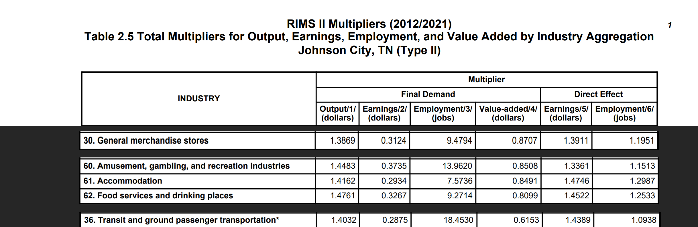
```
\newline 

Final Demand Change: This change is the expected increase in tourism. Because the expansion at Winged Deer park is not expected to draw people from other local programs, this increase does not need to be reduced to account for loses to other regional programs. Most of the tournament participants are expected to come from outside the area, so this increase does not need to be reduced to exclude the purchases of tournament services by local residents. \newline

Investment purchases exclude maintenance and repair expenses because these expenses are treated as intermediate inputs in RIMS II. \newline 
 

## Part 5 Results 
In this section we will look at the results of applying both the Chang’s multiplier and the RIMS II multiplier to the preliminary data. First, we will lookat the applying Chang’s multiplier to the estimates we created using the data
provided. To recap some of the steps needed to meet the requirements and how
we met those requirements:
* Primary Data: The number of teams participating in each tournament
as well the date of the tournament was provided by the JC Parks and
Recreation department.\newline 
* Key Secondary Studies: As alluded to in section 3, "Inexpensively Estimating Economic Impact for Sports Tourism in Small Cities" served as
the foundational secondary study for this work. With it, methods were
outlined that allowed us to recreate the work performed for their analysis.
As such this secondary study served as a blueprint for our work, and in
addition, provided us with an introduction to Chang’s Multiplier which
we were able to duplicate and create a Multiplier unique to our region of
interest.\newline 
* Segment Events: For the preliminary estimates we did not differentiate
between sports events. This is because for the preliminary estimates to
obtain overall spending values there was no need to make this distinction.
Likewise, when using Chang’s multiplier, since it covers the effect on a
region overall, clarifying the difference between events is unnecessary. And
lastly, for RIMS II this is also an unnecessary step. This is most helpful
when trying to segment the spending based on the sport itself, but is not
a hard requirement to be able to provide an region wide impact estimate.
All the same, we do make the differentiation between sports types in order
to provide a breakdown of revenue for the Parks department.\newline 
* Travel Party Days: Travel party days were taken directly from the information provided by the JC Parks and Recreation Department. This information was obtained by taking the duration of the tournament and
using this as the number of travel party days. For example, a tournament
taking place on April 28th would start and end on the 28th and would be
flagged as a one day event, or, for the purposes of the equation would be
equal to 1.\newline 
* Estimating Non-Local Parties: Non-Local percentages of visitors participating in tournaments was obtained from information sent to the group from visitJC. This data was captured during a softball tournament that
had taken place in 2023. With this data we were able to ascertain that
during this tournament there was an 86 percent non local participation
rate. As the values found in secondary studies were close to this value
across all sports, we used this percentage as the non-local percentage for
all estimates performed.\newline 
* Applying a Cost of Living Adjustment: Since all of the spending data
comes from visitJC to create the estimates, there is no Cost of Living
adjustment required as all spending data come from the region of interest.
15\newline 
* Total Direct Spending: Total direct spending also comes from the visitJC data as it pertains to the area of interest and comes directly from
a softball tournament that took place at the park. This data is only for
one tournament, but gives us a baseline of average spending per event per
group.\newline 
* Total Spending Multiplier: Here we have two different sets of Multipliers.
The first is the Chang’s multiplier which was discussed in section 4.1. The
other multipliers come from the RIMS II table, and are broken up by
industry. As such, we have to break the direct spending estimate apart
by industry, which was done using the spending breakdowns provided by
visitJC as a guide for percentage in each industry and then each value was
multiplied by its appropriate multiplier.\newline 

In the figures below we can see these requirements being put into use. First we
take a look at the estimates produced when looking at just the baseball events.
The distinction between events was made by matching the dates provided by
JC Parks and Recreation and matching it with events posted online. It should
be noted that all dates were not able to be accounted for, so some events may
be mis-catergorized, and as such estimates may not be a perfectly accurate
reflection of reality. However, roughly 80 percent of the events that took place
in 2023 were able to be accounted for, and as such any variability in the estimates
should be minimal. For future estimates it would be worthwhile to keep record
of which event took place on which day so that these distinctions can be made
with a higher degree of accuracy.
Figure 10: The comparison 5 fields versus 9 fields using Chang’s and RIMS II
multipliers.
As seen in the figure above, the baseball estimates are broken into estimates
for the current 5 field setup and for the expanded 9 field setup.(NEED TO ADD FIGURE FOR BASEBALL) For the estimates
we start with the average month value for both field counts. This value was
obtained by first segmenting the events into baseball and softball. We then
found the total direct spending for all 3 years based and divided by the number
of months to obtain the average monthly spending value. This yields both the
average direct value and the average monthly value. To find the Chang’s value
we took all 3 years worth of estimates and divided by 3 to create an average
spending per year, and then multiplied this value by the 1.4583 as outlined in
we then multiply this by .65 to apply a capture rate to the multiplier
since Chang’s does not account for leakages in an economy. This provides us
with a base level multiplier affect on the direct spending estimate. Then we
break down the direct spending estimate by industry in order to apply industry
specific RIMS II multipliers to each industry. We then sum each industry back
up to get a RIMS II adjusted estimate for the spending totals. We then take
the RIMS II adjusted spending estimate and multiply the value by 10 to get the
10 year projected spending total based on average spending values. Lastly, to
get the tax rate, we multiply the 10 year adjusted spending by the 2.5 percent
local tax rate for Washington County. In figure 11 below, we can see the same
estimates but for softball instead of baseball.
```{r, echo=FALSE}
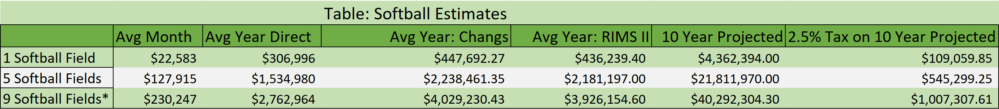
```

Figure 11: Figure 11: Comparison of softball spending using 1 field, 5 field, and
10 field estimates.
In figure 11 above, we perform the same methods to obtain the estimates
listed in figure 10 for the baseball estimates, the only differences between the
two estimates is the distinction between the event types and the further break
down to 1 softball field, the current 5 field setup, and the park post expansion
with 9 softball fields. The monthly, yearly, Chang’s, and RIMS II estimates are
all calculated using the same method as with the baseball estimates.

## 6 Conclusions
It is shown in the results section that, while it will take time to break even
on the project cost, the park will be operating with a positive revenue flow
after the parks expansion. This is in addition to the impact, both direct and
indirect that the visitor spending will have on the region. As a result of the
additional tournaments that are able to take place due to the expansion of the
park, Johnson City as a whole can expect to see roughly double the impact
through visitor spending. The higher spending and higher volume of visitors
to the park will require some time to be established, as the results will not
be instantaneous. As such a reasonable time delay would be 1-2 years after
the expansion is completed that the park begins to see a higher volume of
tournaments and players utilizing the parks facilities and bringing increased
spending into the region. Additional consideration should be given to the soccer
fields as they may take additional time to gain reputation for tournament play
outside of the NE TN region. Undoubtedly, once the soccer fields are in place,
teams from the surrounding region will use them to some extent, but as discussed
in the study, this amounts to local spending in terms of economic impact, and so
local teams will have no impact on this figure. It should however be noted that
the fees charged to any tournament directors will account for the same impact
to the parks financial bottom line as non local tournament fees, it is only for
the economic impact that we must make the distinction between local and non
local spending in the region. Future calculations can be made as data becomes
available. Some considerations that might be made when measuring this data
are:\newline 
The observations received were valuable in terms of creating meaningful
estimates for the park that reflect the past three years of use. Specifically that
they contained the number of teams and the date on which the tournament
occurred. Some additional information that would be useful alongside this to
get more accurate estimates are:\newline 
* The Sport for which the tournament was taking place (Baseball/Softball/Soccer) \newline
* The age group that participated in the tournament \newline
* Number of games played (important when considering soccer field placement)\newline 

Additionally the following additional maintenance data will be useful in more
granular approaches to fiscal estimates:\newline 
* Number of mounds constructed if any and associated cost \newline 
* Time/Material spent drying field after rain-out(s) during a given tournament \newline 
* Number of hours lights were used and number of fields using lights during
a given tournament \newline 
* Any other additional maintenance cost not currently accounted for that
is considered an expenditure by the Parks and Recreation department
that occurs during the course of a tournament or during the prep stages
between tournament \newline

The data from Visit JC was also vital to the calculations made. If it would
be possible, continue to obtain data like the type captured for the softball tournament that was measured. This will allow the Parks and Recreation department to make a distinction between sports in their spending habits, as both the
amount and the percentage in each industry may vary between sport.
Likewise, if its possible to collect enough data to do so, then the Parks and
Recreation department could further make the distinction between age groups
in both their spending habits and their traveling habits (in terms of how many
people they travel with on average).
The more data that is able to be collected the more accurate the estimates
produced will be, as they will account for more of the variation in spending
between events that the current estimates fail to do. As the estimates produced
are based off of averages, they do not cover the distinction between groups or
event types, and as such may be over or under estimating the actual economic
impact and financial outcomes for the park. However, since these estimates are
based in part off of the data obtained from the park and from Visit JC, and
strictly adhere to the methodologies outlined in the referenced secondary studies,
these estimates should be fairly conservative and should provide underestimates
to account for the lack of granular information about visitors.
\newpage


## References

Chang, Wen Huei. 2001. Variations in
Multipliers and Related Economic Ratios for
Recreation and Tourism Impact Analysis.
Michigan State University: Department of
Park, Recreation and Tourism Resources\newline
\newline 
Crompton, John, and Seokho Lee. 2000.
“The Economic Impact of 30 Sports Trends,
Festivals, and Spectator Events in Seven
US Cities" Journal of Park and Recreation
Administration 18, no. 2: 107-126\newline 
\newline 
Stynes, D. J. 1997. Economic Impacts of
Tourism: A Handbook for Tourism Professionals.
Urbana, IL: University of Illinois, Tourism
Research Laboratory\newline 
\newline 
Brewer, Ryan and Freeman,Kayla 2015. "Inexpensively Estimating the Economic Impact of Sports Tourism Programs in Small American Cities" Indiana Business Review Spring 2015\newline 
\newline 
https://www.bea.gov/resources/methodologies/RIMSII-user-guide\newline 


